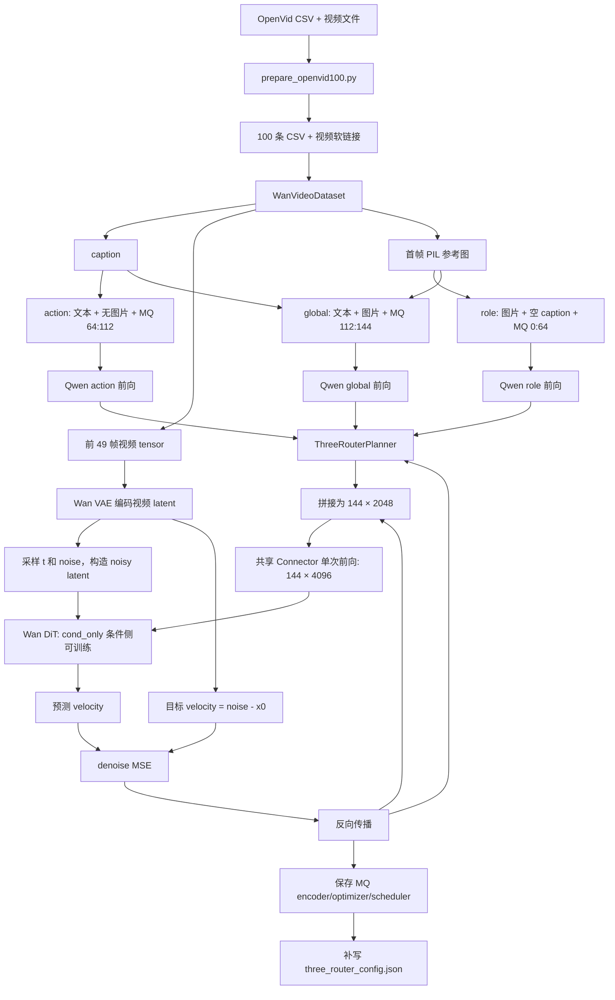

# `three_router_planner` 代码结构与完整数据流程

> **2026-07-30 当前配置提示：** 下文部分 144-token/64-48-32/强首帧绑定文字是
> 旧运行记录。当前有效路径为 256 token（96/96/64）、24 层 Connector、Qwen
> 原始 embedding 整表冻结、三张 FP32 路由表可训练，以及 `legacy_t2v` 首帧
> 软锚定（保留原首 latent、共享随机 t、首帧参与 loss）。当前参数以
> `code/README.md` 与训练入口为准。

## 1. 文档范围

本文详细解释以下目录中的全部源码文件：

```text
/home/liuzhirui/Project/MovieStory/code/three_router_planner/
├── __init__.py
├── config.py
├── planner.py
└── qwen_wan_adapter.py
```

目录中的 `__pycache__/` 只保存 Python 解释器生成的字节码缓存，不属于需要阅读或维护的源码。

为了讲清楚这些文件如何从原始 OpenVid 样本一路走到 Wan 的训练损失和最终 checkpoint，本文也会解释下列外围文件中与 3-router 直接相关的部分：

```text
Project/MovieStory/code/train_openvid100_3router.sh
Project/MovieStory/code/train_3router_planner_wan.py
Project/MovieStory/code/tests/test_three_router_planner.py
model/Wan2.2/scripts-metaquery-single/train/train_connector_for_wan.py
model/Wan2.2/scripts-metaquery-single/train/train_metaquery_wan.py
model/Qwen3-VL-main/metaquery-main/models/model.py
```

## 2. 一句话总览

当前实现是模态隔离的三路 MetaQuery 编码：

1. `role` 使用 `<img0>...<img63>`，只接收参考图，caption 被置空。
2. `action` 使用 `<img64>...<img111>`，只接收 caption，不传参考图。
3. `global` 使用 `<img112>...<img143>`，同时接收参考图和 caption。
4. 三路分别执行 Qwen3-VL 前向，输入序列中只保留本路的 MetaQuery token。
5. Planner 只做形状校验和 role/action/global 切片，不增加任何参数或数值变换。
6. 三路 Qwen 输出按 `role + action + global` 拼成 `[B,144,2048]`，统一调用一次共享 Connector。
7. Connector 输出 `[B,144,4096]`，作为 MQ-only context 直接替代 Wan 原本的 T5 文本 context。
8. 去噪 MSE 同时更新三组显式 MetaQuery 参数、共享 Connector，以及 Wan cross-attn 相关条件侧参数。

需要特别注意：

> 当前隔离边界位于 Qwen 阶段：三路的 MetaQuery 参数、输入模态和 Qwen 前向彼此分开。三路 Qwen 输出随后拼接并统一经过一次双向 Connector，因此 Connector 可以在已经完成模态专属编码的三路表示之间做后融合。

当前仍然没有三个独立的监督损失，也没有 top-k gating 或动态 token 分配。三路严格隔离发生在输入模态、MetaQuery 参数和 Qwen 编码阶段；Connector 与 Wan 是后融合阶段，共同服务于同一个视频去噪目标。

### 2.1 改造前为什么没有实现模态隔离

改造前存在以下问题：

| 层面 | 改造前行为 | 为什么不满足要求 |
|---|---|---|
| Qwen 输入 | caption、参考图和全部 144 个 MQ token 做一次联合前向 | role/action/global 全都能同时看到图和文 |
| MetaQuery 参数 | shell 冻结 Qwen MQ input embeddings | 三组 MetaQuery seed 本身不能分别学习 |
| Guidance | 存在与目标无明确关联的随机标量和 MLP | 缺少语义监督，现已完整删除 |
| Connector | 144 个 token 拼在一起做一次双向 attention | 本身不负责输入模态隔离 |
| 分路语义 | 只加三行 type embedding 后固定切片 | 只是标签先验，不是实际的模态隔离 |

因此改造前只实现了“64/48/32 固定分区”，没有实现“各路专属输入、专属 MetaQuery 参数和隔离更新”。

### 2.2 改造后的隔离边界

现在每路 Qwen seed 只依赖：

```text
role_seed   = Qwen(role MQ params, image)
action_seed = Qwen(action MQ params, text)
global_seed = Qwen(global MQ params, image, text)

planned = Planner(concat(role_seed, action_seed, global_seed))
wan_context = SharedConnector(planned)
```

共享 Qwen 是冻结的，但执行三次独立前向；Connector 是可训练的，并对拼接后的完整 144-token 序列执行一次前向。

Connector 和 Wan cross-attention 可以联合消费三路，这是有意保留的后融合；三组原始 MetaQuery 参数仍只在各自 Qwen 分支中与指定输入模态交互。

## 3. 核心张量和实际训练配置

### 3.1 记号

| 记号 | 含义 |
|---|---|
| `B` | batch size；当前数据加载器实际固定为 1 |
| `N` | MetaQuery token 总数，当前为 144 |
| `Hq` | Qwen 隐藏维度，当前模型实际为 2048 |
| `Hw` | Wan 文本条件维度，固定为 4096 |
| `R` | role token 数，64 |
| `A` | action token 数，48 |
| `G` | global token 数，32 |

满足：

```text
N = R + A + G = 64 + 48 + 32 = 144
```

### 3.2 关键张量形状

| 阶段 | 张量 | 形状 |
|---|---|---|
| role Qwen 输出 | 图片条件序列中的 role seed | `[B, 64, 2048]` |
| action Qwen 输出 | 文本条件序列中的 action seed | `[B, 48, 2048]` |
| global Qwen 输出 | 图文条件序列中的 global seed | `[B, 32, 2048]` |
| 三路拼接 | `route_seed` | `[B, 144, 2048]` |
| 3-router 处理后 | `planned` / `tokens` | `[B, 144, 2048]` |
| role 切片 | `role` | `[B, 64, 2048]` |
| action 切片 | `action` | `[B, 48, 2048]` |
| global 切片 | `global_route` | `[B, 32, 2048]` |
| Connector 输出 | `mq_features` | `[B, 144, 4096]` |
| Wan DiT context | 每个样本的 MQ 条件 | `[144, 4096]` |
| Wan DiT 输出 | velocity 预测 | 与视频 latent 相同 |

### 3.3 当前 shell 脚本决定的训练行为

`train_openvid100_3router.sh` 当前使用：

| 配置项 | 当前值 | 作用 |
|---|---:|---|
| `num_metaqueries` | 144 | 必须与三段 token 总数相同 |
| `connector_num_hidden_layers` | 4 | Connector 使用 4 层双向 Qwen2 Encoder |
| `num_train_steps` | 1000 | 优化器更新步数 |
| `gradient_accumulation_steps` | 2 | 每个优化步累计两个 micro-batch |
| `frame_num` | 49 | 每个视频读取前 49 帧 |
| `max_area` | 262144 | 帧缩放后的最大像素面积 |
| `wan_train_mode` | `cond_only` | 训练 Wan cross-attn、文本条件投影、相关 norm/modulation |
| 显式 route MetaQuery 参数 | 开启训练 | `[64,2048]`、`[48,2048]`、`[32,2048]` 三个独立参数 |
| Qwen 原 input embedding | 冻结 | 仅作为三组显式参数的初始化来源 |
| `mq_gradient_checkpointing` | 开启 | Connector/Qwen 相关路径用计算换显存 |
| T5 alignment | 关闭 | 不计算 T5 辅助对齐损失 |
| MQ/T5 norm probe、match | 关闭 | 不用 T5 范数探针或自动缩放 MQ |
| `null_image_prob` | 0 | 不随机丢弃参考图 |
| `null_caption_prob` | 0 | 不随机清空 caption |

因此，在这份实际配置中可训练的是：

- 共享 Connector；
- 三组显式 MetaQuery 参数，共 144×2048 个标量；
- Wan DiT 的 `cond_only` 条件侧参数。

Wan DiT 的 self-attn、FFN 和其他未命中 `cond_only` 规则的参数仍冻结；Wan VAE、Wan T5、Qwen3-VL backbone 和原始 input embedding 整表也被冻结。三组显式 MetaQuery 参数被单独放入 `weight_decay=0` 的优化器组，避免 MetaQuery seed 被 AdamW 权重衰减。

## 4. 包入口：`__init__.py`

源码：

```python
from .config import ThreeRouterConfig
from .planner import ThreeRouterOutput, ThreeRouterPlanner
from .qwen_wan_adapter import build_three_router_encoder_class
```

### 4.1 作用

这个文件本身不执行模型计算。它把子模块中的主要公共对象集中导出，使外围代码能够写：

```python
from three_router_planner import (
    ThreeRouterConfig,
    ThreeRouterPlanner,
    build_three_router_encoder_class,
)
```

而不需要了解这些类分别位于哪个文件。

### 4.2 `__all__`

`__all__` 声明包对外的正式 API：

- `ThreeRouterConfig`
- `ThreeRouterOutput`
- `ThreeRouterPlanner`
- `build_three_router_encoder_class`

它主要影响 `from three_router_planner import *`，同时也清晰表达哪些符号被认为是稳定的公共接口。

## 5. 配置层：`config.py`

### 5.1 `ThreeRouterConfig`

```python
@dataclass(frozen=True)
class ThreeRouterConfig:
    ...
```

这是整个 planner 的不可变配置对象。

`frozen=True` 表示对象创建后不能直接改字段。例如：

```python
config.role_tokens = 32
```

会报错。这样可以防止 planner 初始化完成后，配置被意外修改而导致切片范围和输入形状彼此不一致。

#### 5.1.1 字段

| 字段 | 文件默认值 | 实际训练值 | 作用 |
|---|---:|---:|---|
| `hidden_size` | 1536 | 2048 | 每个 MetaQuery seed 的隐藏维度 |
| `role_tokens` | 64 | 64 | role 路由占用 token 数 |
| `action_tokens` | 48 | 48 | action 路由占用 token 数 |
| `global_tokens` | 32 | 32 | global 路由占用 token 数 |

`config.py` 中的抽象默认隐藏宽度是 1536，但当前加载的 Qwen3-VL-2B-Thinking 文本隐藏宽度是 2048。因此训练入口 `train_3router_planner_wan.py` 明确把实际默认值覆盖为 2048。

如果直接写：

```python
planner = ThreeRouterPlanner()
```

它会采用 1536；如果通过当前训练入口创建，则采用 2048。这个差异不能忽略，因为 adapter 会严格检查 planner 宽度是否等于 Qwen 的实际隐藏宽度。

#### 5.1.2 `__post_init__()`

配置对象创建后自动执行校验：

1. `hidden_size` 必须为正数。
2. `role_tokens`、`action_tokens`、`global_tokens` 必须为正数。

不合法配置会尽早抛出 `ValueError`，避免等到 tensor 运算时才出现难以定位的错误。

#### 5.1.3 `total_tokens`

```python
return role_tokens + action_tokens + global_tokens
```

当前结果为：

```text
64 + 48 + 32 = 144
```

这是多个位置共同使用的单一事实来源：

- Qwen 需要插入多少个 MetaQuery token；
- planner 输入第二维必须是多少；
- adapter 应该在 BOI/EOI 之间取多少个状态；
- `--num_metaqueries` 是否与路由布局一致。

#### 5.1.4 `route_slices`

构造三个半开区间：

```python
{
    "role": (0, 64),
    "action": (64, 112),
    "global": (112, 144),
}
```

对应 Python 切片：

```python
role = tokens[:, 0:64]
action = tokens[:, 64:112]
global_route = tokens[:, 112:144]
```

三段连续、不重叠，并且覆盖全部 144 个 token。

#### 5.1.5 `to_dict()`

先通过 `asdict()` 导出 dataclass 字段，再补充两个派生值：

- `total_tokens`
- `route_slices`

它用于：

- `--router_check_only` 的 JSON 报告；
- `--router_parse_only` 的配置报告；
- checkpoint 中的 `three_router_config.json`；
- `get_three_router_metadata()`；
- 基础训练参数的持久化。

## 6. Planner 核心：`planner.py`

### 6.1 `ThreeRouterOutput`

这是 planner 前向结果的数据容器：

```python
@dataclass
class ThreeRouterOutput:
    tokens
    role
    action
    global_route
```

#### 6.1.1 字段含义

| 字段 | 含义 |
|---|---|
| `tokens` | 三段路由重新拼在原顺序中的完整 `[B,144,Hq]` tensor |
| `role` | `tokens[:,0:64]` |
| `action` | `tokens[:,64:112]` |
| `global_route` | `tokens[:,112:144]` |

`role`、`action`、`global_route` 是从完整 `tokens` 切出的 tensor。它们不是三个独立网络重新算出来的结果。

#### 6.1.2 `pooled(normalize=True)`

首先对每条路由沿 token 维求均值：

```text
role_pooled   = mean(role, dim=1)   -> [B,Hq]
action_pooled = mean(action, dim=1) -> [B,Hq]
global_pooled = mean(global, dim=1) -> [B,Hq]
```

默认再把结果转成 float32，并在最后一维做 L2 归一化：

```text
v_normalized = v / ||v||₂
```

用途是得到每个路由的粗粒度摘要，便于比较三组表示是否逐渐分化。

它不参与默认训练损失，只用于诊断。

#### 6.1.3 `diagnostics()`

返回：

- `role_action_cosine`
- `role_global_cosine`
- `action_global_cosine`
- `role_rms`
- `action_rms`
- `global_rms`

三个 cosine 是三组平均表示之间的余弦相似度：

```text
cos(role, action) = normalized_role · normalized_action
```

RMS 的计算方式是：

```text
route_rms = sqrt(mean(route²))
```

这些数值可用于观察：

- 三条路由是否仍然高度相似；
- 某一路由的尺度是否异常大或异常小。

adapter 会把最近一次前向的这些诊断结果 `detach()` 后保存在实例中。3-router 训练包装器会读取这些 tensor、过滤 NaN/Inf、计算 batch 均值，并转换为 `train/router_*` 标量指标。它们会进入每步 JSONL、控制台周期日志、W&B（启用时）以及 checkpoint 的 metrics history/summary。

### 6.2 `ThreeRouterPlanner`

#### 6.2.1 `__init__()`

只保存不可变的 `ThreeRouterConfig`。Planner 不再创建 `nn.Parameter` 或
persistent buffer，参数量为 0。

这意味着三路身份完全由三组不同的显式 MetaQuery 参数、不同 token 区间和
不同 Qwen 输入模态确定；Qwen 输出不会再被额外的 route type 向量修改。

#### 6.2.2 `_validate_seed()`

要求输入：

```text
seed_tokens.shape == [B,total_tokens,hidden_size]
```

实际必须为：

```text
[B,144,2048]
```

校验分两步：

1. 必须是三维 tensor；
2. 后两维必须精确匹配配置。

这能提前捕捉：

- Qwen MetaQuery 数量不是 144；
- planner hidden size 与 Qwen 不一致；
- 调用者误传了单样本二维 tensor；
- 路由布局发生变化但外围参数没有同步。

#### 6.2.3 `split()`

先重新校验输入，再按照 `config.route_slices` 切出：

```python
{
    "role": tokens[:, 0:64],
    "action": tokens[:, 64:112],
    "global": tokens[:, 112:144],
}
```

不复制新的语义内容，只建立三段视图/切片。

#### 6.2.4 `forward()`

完整公式为：

```text
tokens = seed_tokens
role, action, global = split(tokens)
```

`seed_tokens` 是三路完整 Qwen 前向后按 role/action/global 拼接的隐藏状态。
Planner 先校验其形状，再切片生成诊断视图；`ThreeRouterOutput.tokens` 与输入
数值完全相同，并直接交给共享 Connector。

#### 6.2.5 当前 planner 能做什么、不能做什么

能做：

- 给训练一个固定的 role/action/global 布局；
- 保持输出 token 数和维度不变，可无缝接入旧 Connector；
- 提供三组表示的诊断切片。

当前不能做：

- 没有三个独立 Transformer/router expert；
- 没有 token 在三条路由间的动态分配；
- 没有 top-k gating、softmax gate 或负载均衡；
- 没有 role/action/global 各自独立的损失；
- 没有三路之间显式的信息交换模块；
- 没有 RSR/RAB、DIM、Oracle/Student distillation、DSN 等后续能力。

三路 Qwen 输出会先拼接，再统一调用一次双向 Connector。Connector 可以对 144 个已完成专属模态编码的 token 做后融合。

## 7. Qwen/Wan 适配层：`qwen_wan_adapter.py`

### 7.1 `build_three_router_encoder_class()`

#### 7.1.1 为什么使用动态子类

这个函数不直接创建 encoder 实例，而是接收原始：

```python
MetaQueryEncoderForWan
```

并动态生成一个子类：

```python
ThreeRouterMetaQueryEncoderForWan
```

设计目的：

- 保留基础类负责的 Qwen3-VL 加载；
- 保留 tokenizer 和图像处理；
- 保留现有 Connector；
- 保留 dtype/device 策略；
- 保留 checkpoint 的大部分兼容性；
- 只替换从 Qwen 隐藏状态到 Connector 之间的前向路径。

函数参数：

| 参数 | 作用 |
|---|---|
| `base_encoder_class` | 原始 `MetaQueryEncoderForWan` 类 |
| `router_config` | 闭包捕获的 3-router 配置 |
| `enabled` | 是否实际执行 planner；关闭时走 baseline |

返回值是一个类，不是对象。

### 7.2 动态类 `ThreeRouterMetaQueryEncoderForWan`

#### 7.2.1 类属性 `three_router_enabled`

由函数参数 `enabled` 固定：

```python
three_router_enabled = bool(enabled)
```

训练入口中：

```text
enabled = not --disable_3router
```

当前 shell 没有传 `--disable_3router`，所以为 `True`。

#### 7.2.2 `__init__()`

初始化流程：

1. 从 kwargs 读取 `num_metaqueries`。
2. 要求它严格等于 `router_config.total_tokens`。
3. 调用基础类构造函数，加载 Qwen、tokenizer 和 Connector。
4. 再次检查基础类没有修改 `num_metaqueries`。
5. 从加载后的 Qwen 获取真实隐藏宽度。
6. 要求真实宽度等于 `router_config.hidden_size`。
7. 创建 `ThreeRouterPlanner`，移动到 encoder 相同的 device 和 dtype。
8. 建立 role/action/global 三组互不重叠的 MetaQuery token ID。
9. 从 Qwen 对应 embedding 行初始化三组显式 `nn.Parameter`。
10. 在三组显式 MetaQuery 参数上注册分组梯度 RMS 监控 hook。
11. 初始化最近一次输出和诊断缓存。

双重 token 数检查的意义是防止：

- 调用方传错；
- 基础类内部默认值或逻辑覆盖调用值；
- planner 切片与 Qwen 实际 token 数不一致。

隐藏宽度检查确保三路 Qwen 输出可以沿最后一维保持一致，并能直接送入
输入宽度为 2048 的共享 Connector。

如果关闭 3-router，planner 仍会被创建，但执行：

```python
self.router_planner.requires_grad_(False)
```

并且前向时不会使用它。

#### 7.2.3 `_tokenize_inputs()`

##### 有参考图

调用基础 tokenizer：

```python
self.tokenize(self.tokenizer, captions, input_images)
```

得到：

- `input_ids`
- `attention_mask`
- `pixel_values`
- `image_sizes`，对于 Qwen-VL 实际对应 `image_grid_thw`

随后：

- 文本 tensor 移到 encoder GPU；
- `pixel_values` 移到相同 GPU 和模型 dtype；
- Qwen-VL/Qwen3-VL 路径对 `pixel_values` 做一次 `squeeze(0)`；
- 图像网格尺寸也移动到 encoder GPU。

##### 无参考图

只 tokenize captions，并把：

```python
pixel_values = None
image_sizes = None
```

最终统一返回四个对象。

#### 7.2.4 `_initialize_route_token_ids()`

把三段位置转换成真实 tokenizer ID：

```text
role:   <img0>   ... <img63>
action: <img64>  ... <img111>
global: <img112> ... <img143>
```

同时检查每个 ID 唯一、三组之间没有重叠。这里保证每个路由能从原 Qwen embedding 中取得自己独立的初始化行，并在输入中找到自己的注入位置。

#### 7.2.5 `_initialize_route_metaquery_parameters()`

从冻结的 Qwen input embedding 中取出三段初始值，复制成：

```text
route_metaquery_embeddings.role   [64,2048]
route_metaquery_embeddings.action [48,2048]
route_metaquery_embeddings.global [32,2048]
```

三个对象都是独立 `nn.Parameter`，不再依赖整张 Qwen embedding weight 参与优化。

#### 7.2.6 `_register_route_embedding_grad_hook()`

在 role/action/global 三个显式 MetaQuery 参数上分别注册只读梯度 hook。每次 backward 时计算：

```text
sqrt(mean(route_embedding_grad²))
```

结果进入：

- `train/router_role_mq_embedding_grad_rms`
- `train/router_action_mq_embedding_grad_rms`
- `train/router_global_mq_embedding_grad_rms`

hook 返回原始 gradient，不会改变优化结果。

#### 7.2.7 `_route_input_embeddings()`

先用冻结的 Qwen embedding 生成完整 `inputs_embeds`，再将本路 MetaQuery 位置替换成对应显式参数。替换后的 tensor 作为 `inputs_embeds` 传给 Qwen，因此梯度可以穿过冻结的 Qwen 回到本路参数，而不会进入原 embedding 表。

#### 7.2.8 `_qwen3vl_position_ids()`

Qwen3-VL 在同时收到图片和 `input_ids` 时，会依据图片占位 token 与 `image_grid_thw` 构造三维 M-RoPE position IDs。但当前必须使用 `inputs_embeds` 注入显式 MetaQuery 参数，而 Qwen 不允许同时传 `input_ids` 和 `inputs_embeds`。

因此 adapter 在前向之前用保留的 `input_ids` 显式计算 position IDs：

- role/global 有图片时，调用 Qwen3-VL 自身的 `get_rope_index()`，保留图片的时间、高度、宽度位置；
- action 没有图片时，由 attention mask 生成普通文本位置，并复制到三个 M-RoPE 轴；
- 最终只把 `inputs_embeds + position_ids` 传入 Qwen。

这一步不是为了模态隔离，而是防止独立 MetaQuery 注入导致 role/global 的视觉位置编码退化。

#### 7.2.9 `_keep_only_route_tokens()`

基础 tokenizer 仍会在 suffix 中放入全部 144 个 MetaQuery token。该函数根据路由删除其他两组 token：

- role prompt 删除 action/global 的 80 个 token；
- action prompt 删除 role/global 的 96 个 token；
- global prompt 删除 role/action 的 112 个 token。

BOI、EOI、文本、视觉 token 和 attention mask 中对应的其他位置保持不变。函数还会校验 batch 内过滤后的长度一致，以及删除数量符合预期。

#### 7.2.10 `_tokenize_route_inputs()`

先调用 `_tokenize_inputs()` 完成正常 Qwen tokenizer/processor，再调用 `_keep_only_route_tokens()` 形成当前路由专属输入。

#### 7.2.11 `_raw_metaquery_states()`

这是 adapter 最关键的拦截点。

基础编码器原本会直接调用：

```text
Qwen -> 选 MetaQuery 状态 -> Connector
```

adapter 需要在 Connector 之前插入 planner，所以手动调用 Qwen backbone。

共同参数：

```python
{
    "attention_mask": attention_mask,
    "use_cache": False,
    "return_dict": True,
}
```

启用 3-router 时额外传 `input_ids=None`、本路显式 `inputs_embeds` 和预先计算的 `position_ids`；baseline 才直接传 `input_ids`。

不同 MLLM 类型使用不同图像参数名：

| 类型 | 图像参数 |
|---|---|
| `qwen3vl` / `qwenvl` | `pixel_values`, `image_grid_thw` |
| `llavaov` | `pixel_values`, `image_sizes` |
| 纯文本其他路径 | 不传图像 |

`MLLMInContext` 已经把语言模型的 `lm_head` 替换为 `Identity`，所以：

```python
hidden = outputs.logits
```

这里名称虽然叫 `logits`，实际内容是最后一层隐藏状态，不是词表概率。

然后逐样本：

1. 找到唯一的 `<begin_of_img>` token，即 BOI；
2. 找到唯一的 `<end_of_img>` token，即 EOI；
3. 选取二者之间的所有隐藏状态；
4. 要求数量严格等于当前路由的 64、48、32，或 baseline 的 144；
5. 将 batch 中各样本 stack。

如果某条样本有零个或多个 BOI/EOI，或者中间数量不符合当前路由，立即报错。

#### 7.2.12 `_empty_captions_like()`

为 role 分支构造与 batch 大小相同的空 caption。role 仍包含固定 chat template/system control token，但不包含样本 caption 的语义内容。

#### 7.2.13 `_isolated_route_seeds()`

依次构造：

| 路由 | caption | reference image | 保留 MQ token |
|---|---|---|---|
| role | 空 | 有 | 0–63 |
| action | 原 caption | 无 | 64–111 |
| global | 原 caption | 有 | 112–143 |

三路分别执行一次 Qwen 前向，再返回三组 seed。

#### 7.2.14 `_connect_joint_routes()`

直接把 Planner 的完整 144-token 输出送入同一个 Connector：

```python
features = connector(router_output.tokens)
```

三路在 Qwen 阶段已经完成各自的模态交互；Connector 在这里统一进行跨路由后融合和 2048→4096 映射。

#### 7.2.15 `forward()`

启用 3-router 时的调用链：

```text
参考图 + 空 caption -> role-only prompt   -> Qwen -> [B,64,2048]
caption + 无图片      -> action-only prompt -> Qwen -> [B,48,2048]
参考图 + caption      -> global prompt      -> Qwen -> [B,32,2048]
                                            │
                                            ▼
                                     拼接 route_seed
                                            │
                                            ▼
                               ThreeRouterPlanner
                                            │
                                  [B,144,2048]
                                            │
                                            ▼
                              shared Connector 一次前向
                                            │
                                            ▼
                                      [B,144,4096]
```

启用 planner 时：

```python
router_output = self.router_planner(route_seed)
features = self._connect_joint_routes(router_output)
```

随后将用于诊断的最近一次输出保存为 detached tensor：

```python
self.last_router_output = detached copy
self.last_router_diagnostics = detached diagnostics
```

这里的 `detach()` 只作用于额外保存的诊断副本；真正传给 Connector 的
`router_output.tokens` 保留计算图。因此训练梯度仍然可以穿过无参数
Planner，回到三组 Qwen 输出以及对应的显式 MetaQuery 参数。

禁用 planner 时：

```python
planned = route_seed
```

禁用 3-router 时保留旧 baseline：图文联合做一次 Qwen 前向，再把完整 144-token 序列送入 Connector 一次。

启用时最后执行：

```python
features = self._connect_joint_routes(router_output)
```

返回 `[B,144,4096]`。

第一次前向会打印：

- planner 是否启用；
- seed 形状；
- features 形状；
- dtype。

#### 7.2.16 `get_three_router_metadata()`

返回：

```python
{
    "enabled": ...,
    **router_config.to_dict(),
}
```

它提供轻量的运行时配置查询，不返回权重。

除基础 config 外，还返回 `routing_mode=isolated_modalities_v1`、三路模态映射、共享 Connector 和 `joint_connector_forward=true` 标记。

#### 7.2.17 动态类名称重写

函数最后设置：

```python
__name__ = "ThreeRouterMetaQueryEncoderForWan"
__qualname__ = "ThreeRouterMetaQueryEncoderForWan"
```

这样日志和部分序列化/检查工具看到的是有意义的类名，而不是带局部作用域路径的动态类名称。

## 8. Qwen 如何产生 144 个原始 seed

这一段逻辑位于外围的 `MLLMInContext`，但它是理解原始输入的必要部分。

### 8.1 特殊 token

初始化时向 tokenizer 加入：

```text
<begin_of_img>
<img0>
<img1>
...
<img143>
<end_of_img>
```

这里的 `<img0>` 到 `<img143>` 是可学习的 MetaQuery 槽位，不是 Qwen 原生视觉 patch token。命名保留了历史习惯。

### 8.2 Prompt 结构

基础 tokenizer 先把 caption 和可选参考图套入 chat template，并在末尾追加：

```text
<begin_of_img><img0><img1>...<img143><end_of_img>
```

adapter 随后会删除另外两路 MetaQuery token，所以每次 Qwen3-VL 前向只保留本路片段。每个本路 MetaQuery 位置的隐藏状态可以通过 self-attention 汇聚：

- system prompt；
- 本路允许的 caption 和/或参考图视觉 token；
- 本路的其他 MetaQuery token；
- 上下文中的其他特殊 token。

所以每个 route seed 不是孤立 embedding，而是 Qwen 处理本路专属上下文后的隐藏表示；它不会在该次 Qwen 前向里读取另外两路 MetaQuery token。

### 8.3 为什么 adapter 不直接使用 `encode_condition()`

基础 `encode_condition()` 做的是：

```text
Qwen hidden
 -> 选 BOI/EOI 之间的 token
 -> Connector
 -> [B,N,4096]
```

如果直接调用它，planner 只能插在 Connector 之后，隐藏维度已经变成 4096，也失去了在原始 Qwen MetaQuery 状态上做路由标记的机会。

adapter 因此复制“Qwen forward + 选 token”的部分，在 Connector 之前拿到 `[B,144,2048]`。

## 9. Connector 的作用

Connector 由基础 `MetaQueryEncoderForWan` 创建。当前 shell 指定 4 个隐藏层，结构为：

```text
[B,144,2048]
  │
4-layer bidirectional Qwen2Encoder
  │
Linear(2048 -> 4096)
  │
GELU
  │
Linear(4096 -> 4096)
  │
RMSNorm
  │
[B,144,4096]
```

### 9.1 双向 Qwen2 Encoder

这个 Encoder 的 self-attention 明确设置为非 causal，所以每个 token 可以同时看到它前后位置的 token。

当前 Connector 对拼接后的 144 个 token 做一次双向 self-attention。因此 role/action/global 可以在 Connector 中交换已经由 Qwen 编码好的高层表示。这是有意设计的后融合；原始文本和图片的严格可见性限制由前面的三次 Qwen 输入保证。

### 9.2 维度投影

Qwen 隐藏维度为 2048，而 Wan 的文本条件维度为 4096。两个 Linear 和 GELU 完成可学习的空间转换，最后 RMSNorm 稳定输出尺度。

### 9.3 可训练状态

基础 encoder 会：

- 冻结 Qwen backbone；
- 打开 Connector 的 `requires_grad`；
- 根据参数决定是否训练输入 embedding。

当前 shell 传入 `--freeze_mq_input_embeddings`，冻结 Qwen 原始 input embedding 整表。adapter 从 `<img0>...<img143>` 对应行复制初值，创建 role/action/global 三个显式 `nn.Parameter`，再通过 `inputs_embeds` 注入 Qwen。

三个显式 MetaQuery 参数被单独放入 `weight_decay=0` 的 optimizer group。

动态子类新注册的 `router_planner` 是 `mq_encoder` 的子模块，`get_trainable_params()` 会遍历整个动态 encoder 的所有参数，因此 planner 参数也会自动进入优化器。

## 10. 训练包装入口：`train_3router_planner_wan.py`

### 10.1 路径注入

脚本把以下目录加入 `sys.path`：

- MovieStory `code/`
- Wan 训练脚本目录
- Wan 根目录
- MetaQuery 根目录

这样可以同时导入本项目 planner、Wan 训练器和 Qwen MetaQuery 代码。

### 10.2 `parse_router_args()`

使用 `parse_known_args()`：

- 识别 `--router_*` 和 `--disable_3router` 等 planner 参数；
- 未识别的参数原样留给基础 Wan parser。

这样 3-router 和原训练脚本可以共享一个命令行，而不需要复制基础训练器的全部 argparse 定义。

还提供：

- `--router_check_only`：只在 CPU 上检查 planner 形状和反向传播；
- `--router_parse_only`：检查 router 参数和基础 Wan 参数能否一起解析，不加载大模型。

### 10.3 `build_config()`

把 argparse namespace 映射成 `ThreeRouterConfig`。创建 dataclass 时会自动触发全部合法性校验。

### 10.4 `run_check_only()`

流程：

1. 固定随机种子；
2. 创建 planner；
3. 构造 `[2,N,Hq]` 的随机 seed，并启用 seed 梯度；
4. 对输出平方均值做反向传播；
5. 输出配置、形状、梯度有限性和参数量。

实际当前配置检查结果：

```text
output          [2,144,2048]
role            [2,64,2048]
action          [2,48,2048]
global          [2,32,2048]
seed grad       finite
planner params  0
```

它验证 planner 本身，但不加载 Qwen、Connector、Wan 或真实视频。

### 10.5 `_write_router_metadata()`

在每个 checkpoint 目录中额外写：

```text
three_router_config.json
```

内容包括：

- 格式标识 `moviestory_three_router_planner_v4_direct_qwen_connector`；
- planner 是否启用；
- 全部配置字段；
- token 总数；
- 三段切片位置。
- Qwen 输出是否不经额外变换直接进入 Connector。

这使 checkpoint 使用者不必根据 tensor 形状猜测当时的路由布局。

### 10.6 `run_training()`

这是 3-router 接入现有训练器的关键。

#### 10.6.1 动态 patch

先导入：

```python
import train_connector_for_wan as connector_module
import train_metaquery_wan as base_train
```

然后创建动态子类并替换模块属性：

```python
patched_encoder = build_three_router_encoder_class(
    connector_module.MetaQueryEncoderForWan,
    config,
    enabled=enabled,
)
connector_module.MetaQueryEncoderForWan = patched_encoder
```

基础训练器在 `_load_models()` 中执行局部 import：

```python
from train_connector_for_wan import MetaQueryEncoderForWan
```

因为该模块属性已经被替换，所以它实际拿到的是动态的 3-router 子类，而不是原类。

这是一种运行时 monkey patch。优点是无需修改庞大的原训练文件；代价是调用顺序很重要，阅读时必须知道类已经被替换。

#### 10.6.2 基础参数解析

暂时用 `base_argv` 替换 `sys.argv`，调用基础训练器的 `parse_args()`，完成后恢复原值。

随后再次确保：

```text
args.num_metaqueries == config.total_tokens
```

#### 10.6.3 将 router 配置注入训练参数

把 router 参数写进基础 args，并增加：

- `args.router_config`
- `args.three_router_enabled`

这样基础 checkpoint 的训练参数文件也能记录这些信息。

#### 10.6.4 扩展 checkpoint 保存

动态定义：

```python
class ThreeRouterWanTrainer(base_trainer_class):
    def _save_checkpoint(...):
        super()._save_checkpoint(...)
        _write_router_metadata(...)
```

所以每次基础训练器保存 MQ/优化器/调度器状态后，还会补写 3-router 配置 JSON。

#### 10.6.5 接入 router 诊断指标

动态 trainer 覆盖 `_collect_trainability_metrics()`，从 encoder 的 `last_router_diagnostics` 读取最近一个 batch 的诊断 tensor，并生成：

```text
train/router_role_action_cosine
train/router_role_global_cosine
train/router_action_global_cosine
train/router_role_rms
train/router_action_rms
train/router_global_rms
train/router_role_mq_embedding_grad_rms
train/router_action_mq_embedding_grad_rms
train/router_global_mq_embedding_grad_rms
```

每个 tensor 会先过滤非有限值，再取 batch 均值。基础训练循环随后会自动：

- 每步写入 `logs/train_metrics.jsonl`；
- 在现有日志间隔打印一行 `[3-ROUTER][DIAG]`；
- 启用 W&B 时随其他训练 metrics 一起上报；
- 放入 checkpoint 的 `metrics_tail`；
- 在 `metrics_summary.json` 中保存每项指标的最后值和平均值。

这些指标用于判断三路表示是否分化、尺度是否稳定以及三组 MetaQuery 是否收到梯度，不参与损失计算。

#### 10.6.6 启动训练

最后：

```python
trainer = ThreeRouterWanTrainer(args)
trainer.train()
```

## 11. 从 OpenVid 原始输入到训练输出的完整流程

### 11.1 总流程图



### 11.2 第 1 步：准备 OpenVid100

`prepare_openvid100.py`：

1. 按 CSV 顺序扫描；
2. 解析 video 和 caption 列；
3. 找到前 100 条可用视频；
4. 在 `tmp/openvid_first100/videos` 下创建软链接；
5. 写出 `openvid_first100.csv`；
6. 写出 manifest。

这里不复制大视频文件，软链接指向 NAS 原视频。

### 11.3 第 2 步：数据集读取

`WanVideoDataset`：

1. 从 CSV 获取 caption 和视频路径；
2. 检查 caption token 长度；
3. 用 OpenCV 从视频开头连续读取 49 帧；
4. 按最大面积 262144 缩放；
5. 把高、宽向下对齐到 32 的倍数；
6. 像素归一化到 `[-1,1]`；
7. 形成 `[3,49,H,W]` 视频 tensor；
8. 取处理后的第一帧形成 PIL 参考图。

样本字典关键字段：

```python
{
    "caption": str,
    "video": Tensor[3,T,H,W],
    "ref_image": PIL.Image,
    "mq_ref_image": PIL.Image | None,
    "video_path": str,
}
```

当前两个 null probability 都是 0，因此 caption 和 `mq_ref_image` 不会被随机丢弃。

### 11.4 第 3 步：构造 Qwen 输入

训练器把：

- `caption`
- `mq_ref_image`

传给动态 MetaQuery encoder。

adapter 构造三份输入：

- role：空 caption、参考图，只保留 `<img0>...<img63>`；
- action：原 caption、无参考图，只保留 `<img64>...<img111>`；
- global：原 caption、参考图，只保留 `<img112>...<img143>`。

每份输入仍包含固定 system/chat template 和 BOI/EOI 控制 token。这里的“role 只和图片交互”指不包含样本 caption；固定模板 token 仍是 Qwen 正常运行所需的结构输入。

### 11.5 第 4 步：Qwen3-VL 上下文编码

Qwen3-VL 分别执行三次前向。每次输入只含本路 MetaQuery token，并按上节限制样本模态。由于三组显式 MetaQuery 参数通过 `inputs_embeds` 注入，adapter 还会预先从原 `input_ids` 计算 Qwen3-VL position IDs：role/global 保留图片三维 M-RoPE，action 使用三轴相同的文本位置。

由于 `lm_head=Identity`，输出的 `outputs.logits` 是：

```text
[B,完整序列长度,2048]
```

adapter 分别选择 BOI 与 EOI 之间的位置：

```text
role_seed   [B,64,2048]
action_seed [B,48,2048]
global_seed [B,32,2048]
```

再按固定顺序拼成 `[B,144,2048]`。

### 11.6 第 5 步：3-router 规划

Planner 不再采样额外控制标量，也没有 guidance MLP。它只执行：

```text
planned = route_seed + route_type
```

形成三段固定布局：

```text
0   ───────── 63   role
64  ───────── 111  action
112 ───────── 143  global
```

最终仍以原顺序组成：

```text
planned [B,144,2048]
```

### 11.7 第 6 步：Connector 映射到 Wan 条件空间

三路 `planned` token 先拼接，再统一做一次前向：

```text
connector(planned) [B,144,2048] -> [B,144,4096]
```

Connector 同时负责统一空间映射与三路后融合。

当前关闭 T5 alignment、T5 norm probe 和 T5 norm match，所以 MQ features 不再与 T5 条件拼接或自动对齐。

每条样本的 MQ features 被复制/移动到 DiT 所在 GPU，组成：

```text
augmented_context: List[Tensor[144,4096]]
```

### 11.8 第 7 步：视频编码和 Flow Matching 输入

Wan VAE 在无梯度模式下把视频编码成：

```text
x0 = latent [Cz,T',H',W']
```

对每条样本采样：

```text
t ~ Uniform(0,1)
noise ~ Normal(0,I)
```

构造 noisy latent：

```text
x_t = (1-t) × x0 + t × noise
```

训练目标 velocity：

```text
target = noise - x0
```

当前 shell 没有开启 animate slot 或首帧软锚定参数，所以第一帧主要通过 Qwen/MQ 图像条件进入链路；默认 `legacy_t2v` 下不会额外把参考 latent 前缀拼入目标视频。

### 11.9 第 8 步：Wan DiT 前向

临时把 Wan 模型 text length 改成 144，然后调用：

```python
model_output = wan.model(
    x_inputs,
    t=timesteps_wan,
    context=augmented_context,
    seq_len=max_seq_len,
)
```

Wan DiT 接收：

- noisy video latent；
- diffusion/flow timestep；
- 3-router 产生的 144 个 4096 维条件 token。

输出对 velocity 的预测。

### 11.10 第 9 步：损失

当前训练版本只使用去噪主损失：

```text
loss = MSE(predicted_velocity, noise - x0)
```

虽然基础训练器保留了一些 T5 对齐、图像保持、函数蒸馏相关代码和日志字段，但当前实际总损失明确设为：

```python
total_loss = denoise_loss
```

### 11.11 第 10 步：反向传播

梯度路径为：

```text
denoise MSE
  -> Wan DiT 的 cond_only 条件侧参数
  -> mq_features
  -> 拼接后的共享 Connector 单次前向
  -> 无参数 Planner 的原样透传
  -> 三路 Qwen MetaQuery 隐藏状态
  -> 各路显式 MetaQuery 参数
```

当前 Wan DiT 不是完全冻结：cross-attn、文本条件投影、`norm3`、time projection 和 modulation 等 `cond_only` 参数参与更新；self-attn、FFN 等其他 Wan 参数保持冻结。无论某个 Wan 参数是否冻结，计算图仍能把对 context 的梯度继续传回 Connector。

当前 Qwen backbone 和原 input embedding 整表冻结，但三个显式 route MetaQuery 参数可训练。role/action/global 的 Qwen 前向只注入各自参数，因此三组参数对象不会互相替代或共享；但由于 Connector 和 Wan 使用同一个联合去噪损失，三组梯度在后融合阶段仍然是耦合的。

### 11.12 第 11 步：优化器更新

基础训练器通过：

```python
module.get_trainable_params()
```

收集动态 MetaQuery encoder 下所有 `requires_grad=True` 的参数。因此会包含：

- Connector；
- role/action/global 三组显式 MetaQuery 参数；
- router type embedding；
- Wan `cond_only` 条件侧参数。

使用 AdamW、梯度裁剪和学习率调度器更新。

每两个 micro-batch 累计一次梯度后执行一次 optimizer step。

### 11.13 第 12 步：最终输出

这里要区分三种“输出”。

#### A. Planner 自身输出

```text
ThreeRouterOutput:
  tokens          [B,144,2048]
  role            [B,64,2048]
  action          [B,48,2048]
  global_route    [B,32,2048]
```

#### B. Encoder 对 Wan 的输出

```text
mq_features [B,144,4096]
```

这是目录内代码对外最重要的功能输出。

#### C. 完整训练任务输出

完整训练脚本最终保存：

- MetaQuery encoder state，其中包含 Connector 和 `router_planner` 权重；
- Wan `cond_only` 可训练参数 state；
- optimizer state；
- scheduler state；
- training args；
- metrics；
- 训练前、周期性和最终 checkpoint；
- 每个 checkpoint 额外的 `three_router_config.json`。

训练路径本身不直接输出最终视频文件。它输出的是可供后续推理加载的条件编码器/3-router checkpoint，以及训练指标。

## 12. Checkpoint 中与 3-router 有关的内容

动态 encoder 把无参数 planner 注册为：

```python
self.router_planner = ThreeRouterPlanner(...)
```

Planner 自身不再向 `state_dict()` 增加参数或 buffer。真正学到的三路 seed
保存在动态 encoder 的：

```text
route_metaquery_embeddings.role
route_metaquery_embeddings.action
route_metaquery_embeddings.global
```

外围 trainer 又补写 `three_router_config.json`，使结构配置和权重同时可恢复。

仅有配置 JSON 不足以恢复模型；真正学到的内容仍在 MQ encoder 权重文件中。

## 13. 测试文件：`tests/test_three_router_planner.py`

虽然它不在 `three_router_planner/` 包目录内，但覆盖了核心行为。

### 13.1 `setUp()`

创建缩小版配置：

```text
hidden=32
role=6
action=5
global=3
total=14
```

这样测试速度快，同时保留真实结构。

### 13.2 `test_shapes_and_layout`

验证：

- 完整输出形状；
- 三段切片形状；
- token 数之和正确。

### 13.3 `test_gradient_reaches_seed`

对输出平方均值反向传播，验证：

- seed 有有限梯度；

说明 planner 没有意外 detach 主计算图。

### 13.4 `test_rejects_invalid_layout`

传入 13 个 token，而配置需要 14 个，要求抛出 shape mismatch。

### 13.5 `test_bfloat16_module_preserves_dtype`

planner 和 seed 使用 bfloat16，验证最终输出仍为 bfloat16。

这覆盖了真实训练中模型特征为 bfloat16 的情况。

### 13.6 `test_diagnostics_are_converted_to_batch_mean_metrics`

构造 batch size 为 2 的诊断 tensor，验证它们被正确转换为带 `train/router_*` 前缀的 batch 均值标量。

### 13.7 `test_diagnostic_metrics_ignore_non_finite_values`

验证指标转换会忽略 NaN 和 Inf；如果某个诊断 tensor 没有任何有限值，则不输出对应指标，避免污染 JSONL、W&B 和 checkpoint summary。

### 13.8 `test_route_metaqueries_get_zero_weight_decay_optimizer_group`

验证三个显式 MetaQuery 参数可以从普通 MQ 参数组中拆出，并保持学习率调度器 group 数一致、`weight_decay=0` 且 optimizer/scheduler 能正常 step。

### 13.9 `test_adapter_isolates_qwen_modalities_then_uses_one_connector_sequence`

使用轻量 dummy Qwen 验证三次调用分别为“仅图片、仅文本、图文联合”，且共享 Connector 只调用一次并收到完整 144-token 序列。

### 13.10 `test_qwen3vl_position_ids_preserve_image_rope_and_text_padding`

验证图像分支会调用 Qwen3-VL 自身的 3D RoPE 计算，同时文本分支能根据左 padding attention mask 构造正确的三轴文本位置。

### 13.11 `test_joint_loss_updates_all_route_metaquery_parameters`

对完整 MQ features 反向传播，验证三组显式 MetaQuery 参数都有梯度，而原 Qwen input embedding 整表没有梯度。

### 13.12 `test_planner_is_parameter_free_identity_split`

验证 Planner 参数量为 0、输出与输入逐元素相同，并且诊断字典中没有残留的
guidance 字段。

### 13.13 当前测试结果

从 `Project/MovieStory/code` 目录运行：

```bash
python -m unittest discover -s tests -p 'test_three_router_planner.py'
```

结果：

```text
Ran 11 tests
OK
```

直接从其他目录运行测试文件可能因为 `code/` 不在 `sys.path` 中而无法导入 `three_router_planner`。这是测试启动路径问题，不是 planner 逻辑失败。

## 14. 异常和保护机制汇总

| 检查位置 | 可捕捉的问题 |
|---|---|
| `ThreeRouterConfig.__post_init__` | 非正隐藏宽度或 token 数 |
| adapter `__init__` 第一次检查 | 调用方的 `num_metaqueries` 与布局不一致 |
| adapter `__init__` 第二次检查 | 基础 encoder 意外修改 token 数 |
| adapter hidden size 检查 | Qwen 宽度与 planner 宽度不一致 |
| `_raw_metaquery_states` | BOI/EOI 数量不唯一 |
| `_raw_metaquery_states` | BOI/EOI 之间不是恰好 144 个状态 |
| `_validate_seed` | 输入 rank、token 数或隐藏宽度错误 |
| 训练入口检查 | CLI 的 `--num_metaqueries` 与 config 不一致 |

这些检查使错误尽量在靠近来源的位置发生。

## 15. 最容易产生误解的关键点

### 15.1 三路不是三套完整 Qwen，但确实是三次隔离前向

三路共享同一个冻结 Qwen backbone 和同一个可训练 Connector，但输入序列、
输入模态、MetaQuery token ID 和显式 MetaQuery 参数分开。Planner 只做固定
切片和形状校验，不包含可训练参数。

因此没有复制三套大模型权重。每路在 Qwen 中不会读取另外两路 token；进入拼接后的 Connector 后则允许跨路由后融合。

### 15.2 `global_route` 没有额外聚合操作

它只是最后 32 个 token。它叫 global，是因为这 32 个独立 MetaQuery 参数只在
图文联合 Qwen 分支中使用，并被设计为承担全局语义；代码没有自动把前 112 个
token 汇总到这里。

global 在自己的图文联合 Qwen 前向中完成全局模态编码；进入统一 Connector 后可以再读取 role/action 的高层表示做后融合。

### 15.3 Planner 不再增加任何隐藏变换

当前既没有随机 guidance，也没有 route type embedding。三路 Qwen 输出拼接后
只经过无参数的形状校验/切片，随后直接调用一次共享 Connector。

### 15.4 诊断值目前不进入损失

cosine、RMS 和三组 MetaQuery gradient RMS 会进入 JSONL、控制台、W&B 和 checkpoint 指标，但不会主动拉开三路表示，也不会约束它们的尺度。当前用途是训练监控，而不是辅助损失。

### 15.5 训练最终条件是 MQ-only

当前 Wan context 是 144 个 MQ features，不再与 T5 token 拼接。T5 alignment 和 norm matching 也在 shell 中关闭。

### 15.6 当前任务是训练，不是直接生成视频

`ThreeRouterPlanner.forward()` 的最终输出是条件 token；训练器的最终输出是 checkpoint。真正的视频生成还需要单独的推理脚本加载这些权重并执行 Wan sampling。

### 15.7 基础冻结审计可能打印一条 planner 命名警告

基础训练器的审计逻辑把可训练 MQ 参数名称粗略分成 `connector`、`embed` 和“其他”。新加入的参数名以 `router_planner.*` 开头，所以日志可能出现：

```text
[AUDIT][MQ][WARN] 检测到非 connector/embed 命名的可训练参数: router_planner...
```

对当前 3-router 任务而言，这些正是预期需要训练的新参数。该分支只打印提示，并不会仅因这些名称触发严格冻结失败；优化器仍会通过 `get_trainable_params()` 正常收集它们。

## 16. 模块依赖关系

```text
three_router_planner/__init__.py
 ├── exports ThreeRouterConfig
 ├── exports ThreeRouterOutput
 ├── exports ThreeRouterPlanner
 └── exports build_three_router_encoder_class

config.py
 └── ThreeRouterConfig

planner.py
 ├── depends on ThreeRouterConfig
 ├── ThreeRouterOutput
 └── ThreeRouterPlanner

qwen_wan_adapter.py
 ├── depends on ThreeRouterConfig
 ├── depends on ThreeRouterPlanner/Output
 └── dynamically subclasses MetaQueryEncoderForWan

train_3router_planner_wan.py
 ├── builds config
 ├── patches MetaQueryEncoderForWan
 ├── subclasses MetaQueryWanTrainer
 └── adds router metadata to checkpoints
```

## 17. 为什么删除了 `guidance_scale`

旧版本曾把一个与训练目标独立的 `[0,1]` 随机数送入三套 MLP，但没有强度标签、条件 dropout 映射、单调性或一致性监督，因此无法保证它学到可解释语义，反而增加参数、CLI 和日志复杂度。

当前版本已完整删除：

- `guidance_scale` 前向参数和 Beta 采样；
- 三套 guidance MLP；
- guidance 配置字段与 CLI；
- guidance 诊断指标和 checkpoint 字段。

现在 Planner 的确定性公式只有：

```text
planned = route_seed + route_type_embedding
```

Wan 推理配置中的 `sample_guide_scale=5.0` 属于真正的 CFG sampling 参数，与这里删除的旧 planner 标量不是同一机制，也没有被删除。

## 18. 当前全流程中的可训练参数

### 18.1 三组显式 MetaQuery 参数

adapter 从 Qwen 原 `` embedding 初始化三个独立参数：

| 参数 | 形状 | 参数量 | 输入模态 |
|---|---:|---:|---|
| `route_metaquery_embeddings.role` | `[64,2048]` | 131,072 | 参考图 |
| `route_metaquery_embeddings.action` | `[48,2048]` | 98,304 | caption |
| `route_metaquery_embeddings.global` | `[32,2048]` | 65,536 | 参考图 + caption |
| 合计 | `[144,2048]` | 294,912 | 三路隔离 |

原始 Qwen input embedding 表被冻结。这三个参数通过 `inputs_embeds` 注入对应 Qwen 分支，是真正分开的 `nn.Parameter`，并在 checkpoint 中分别保存。

它们使用独立 optimizer group，`weight_decay=0`，避免 MetaQuery seed 被 AdamW 衰减。

### 18.2 `ThreeRouterPlanner`

Planner 只负责形状校验、固定切片和诊断，不含 `nn.Parameter`，参数量为 **0**。
三路可学习 seed 已全部由上一节的三个 `route_metaquery_embeddings` 承担。

### 18.3 共享 Connector

Connector 只有一套参数，对拼接后的三路序列调用一次：

```text
4 层双向 Qwen2Encoder，hidden=2048，intermediate=8192
Linear(2048 -> 4096)
GELU
Linear(4096 -> 4096)
RMSNorm(4096)
```

在当前 `moviestory` 环境的 transformers 实现中，实测有 **293,670,912** 个可训练参数。该数值包含每层 Q/K/V projection bias 和 Q/K norm；它在一次联合前向中接收来自三条 Qwen 路径的拼接表示。

共享 Connector 是有意设计：

- 优点：三路始终映射到同一个 Wan 4096 维条件空间，适配更稳定；
- 优点：不需要存储三套约 2.94 亿参数；
- Qwen 隔离仍成立：每组 MQ 参数只在指定模态的 Qwen 分支中注入；
- Connector 负责后融合：其 self-attention 可以联合读取三路表示；
- 非完全参数独立：任一路的梯度都会更新共享 Connector，进而影响后续三路。

### 18.4 Wan `cond_only` 条件侧

当前 shell 使用 `--wan_train_mode cond_only`。基础训练器先冻结整个 Wan DiT，再按参数名打开：

- 30 层 `blocks.*.cross_attn.*`；
- `blocks.*.norm3.*`；
- `text_embedding.*`；
- `time_projection.*`；
- block/head 的 `modulation`。

根据当前 Wan2.2-TI2V-5B checkpoint tensor 形状和基础训练器的实际匹配规则，参数量为：

| Wan 条件侧类别 | tensor 数 | 参数量 |
|---|---:|---:|
| cross-attn Q/K/V/O 与 Q/K norm | 300 | 1,133,015,040 |
| text embedding/projection | 4 | 22,026,240 |
| time projection | 2 | 56,641,536 |
| `norm3` | 60 | 184,320 |
| modulation | 31 | 559,104 |
| Wan `cond_only` 合计 | 397 | **1,212,426,240** |

因此 Wan 不再只是传梯度的冻结函数；它的条件消费能力会和新的三路 MQ context 一起适配。self-attn、FFN、patch embedding 和输出头等未命中上述规则的参数仍冻结。

### 18.5 有效可训练参数总量

```text
Wan cond_only 条件侧            1,212,426,240
共享 Connector                  293,670,912
三组显式 MetaQuery 参数             294,912
------------------------------------------------
有效可训练参数合计            1,506,392,064
```

该数值不包含冻结的 Qwen、Wan self-attn/FFN、VAE 和 UMT5 参数。

### 18.6 当前被冻结的参数

- Qwen3-VL 视觉编码器；
- Qwen3-VL 语言 backbone；
- Qwen 原始 input embedding 整表；
- Wan TI2V DiT 中不属于 `cond_only` 的 self-attn、FFN 等参数；
- Wan VAE；
- Wan UMT5 文本编码器；
- `route_ids` buffer 本身不是参数。

## 19. 当前调用的 Qwen/Wan 模型和组件

### 19.1 Qwen 主模型

模型路径：

```text
/home/liuzhirui/model/Qwen3-VL-main/Qwen3-VL-2B-Thinking
```

加载类：

```text
transformers.Qwen3VLForConditionalGeneration
```

在项目中的包装：

```text
MLLMInContext
```

实际用到：

- Qwen3-VL processor/tokenizer；
- 视觉编码器，用于 role/global 的参考图；
- 语言 backbone，用于三路 MetaQuery 上下文编码；
- 2048 维输入/隐藏空间。

本地 `config.json` 中的关键规格是：

| Qwen3-VL 组件 | 当前规格 |
|---|---|
| 文本 Transformer | 28 层，hidden 2048，FFN 6144 |
| 文本 attention | 16 个 query heads，8 个 KV heads，head dim 128 |
| 视觉 Transformer | 24 层，hidden 1024，FFN 4096，16 heads |
| 视觉输出宽度 | 2048，与文本 hidden 对齐 |
| 视觉 patch / merge | patch size 16，spatial merge size 2 |

`lm_head` 被替换为 `Identity`，因此代码读取的 `outputs.logits` 实际是 2048 维隐藏状态，而不是词表 logits。

Qwen backbone 权重全部冻结。三组显式 MetaQuery 参数在 embedding 后以 `inputs_embeds` 形式注入，所以可以经过冻结的 Qwen attention 获得模态条件信息，同时只更新自身。

`MLLMInContextConfig` 使用 `diffusion_model_id="none"`，所以 Qwen 包装层不会额外加载 Sana、Stable Diffusion 等图像生成 backbone。

### 19.2 Qwen2 Connector

它不是从另一个 Qwen2 checkpoint 加载的完整语言模型，而是在 `MetaQueryEncoderForWan` 中新建的可训练模块：

```text
Qwen2Encoder × 4
```

配置：

- hidden size：2048；
- intermediate size：8192；
- attention heads：32；
- KV heads：32；
- 非 causal 双向 attention；
- RoPE；
- Q/K norm；
- gradient checkpointing 开启。

之后接两个投影层和 RMSNorm，把输出变成 Wan 所需的 4096 维。

Connector 仅借用了 Qwen2 block 结构，参数是新随机初始化的，并不加载另一份 Qwen2 预训练 checkpoint。

### 19.3 Wan 主模型

checkpoint 路径：

```text
/home/liuzhirui/model/Wan2.2/Wan2.2-TI2V-5B
```

加载包装：

```text
wan.WanTI2V
```

配置：

```text
WAN_CONFIGS["ti2v-5B"]
```

主要组件：

| 组件 | 当前作用 | 是否训练 |
|---|---|---|
| Wan TI2V 5B DiT / `WanModel` | 接收 noisy latent、timestep 和 144×4096 MQ context，预测 velocity | `cond_only`：训练 cross-attn 相关条件侧 |
| Wan 2.2 VAE / `Wan2_2_VAE` | 将 49 帧视频编码成 latent | 冻结、无梯度 |
| Wan UMT5-XXL / `T5EncoderModel` | Wan 自带文本编码器 | 冻结，配置为 CPU |

本地 Wan 配置的关键规格是：

| Wan 组件 | 当前规格 |
|---|---|
| DiT | 30 层，model dim 3072，FFN dim 14336 |
| DiT attention | 24 heads，Q/K norm 与 cross-attention norm 开启 |
| 输入/输出 latent channel | 48 / 48 |
| 文本条件宽度 | 4096；原生 text length 512，训练时临时改为 144 |
| VAE stride | 时间 4、空间 16×16 |
| DiT patch size | 1×2×2 |
| 训练扩散时间步 | 1000 |

当前是 MQ-only 条件训练，并关闭 T5 alignment、MQ/T5 norm probe 和 norm match，所以 UMT5 会随 Wan pipeline 初始化，但当前主 loss 路径不调用它生成训练 context。

TI2V 5B 路径不使用 Wan I2V-A14B 所需的额外 CLIP 图像编码器。

### 19.4 数据过滤 tokenizer

`caption_tokenizer_path` 默认是：

```text
google/umt5-xxl
```

数据集会使用相应 tokenizer 检查 caption token 长度。它只做数据过滤，不属于当前可训练模型。

## 20. 最终总结

从功能分层看，这套代码可以拆成四层：

1. **配置层**：`ThreeRouterConfig` 定义三段 token 的尺寸和合法性。
2. **规划层**：`ThreeRouterPlanner` 给 Qwen seed 加三类身份 embedding，并提供固定切片。
3. **适配层**：动态 MetaQuery encoder 在 Qwen 与 Connector 之间插入 planner，保持原 Wan 接口不变。
4. **训练集成层**：训练包装器动态 patch 基础类，让 Wan 去噪损失训练 MetaQuery、Connector、planner 和 Wan `cond_only` 条件侧，并把权重与结构配置一起保存。

完整的主数据流是：

```text
OpenVid caption + 首帧
  -> role 图片 Qwen / action 文本 Qwen / global 图文 Qwen
  -> 64 + 48 + 32 个隔离 MetaQuery seed
  -> 拼接为 144×2048
  -> 无参数 Planner 校验/切片（数值不变）
  -> 同一个 4 层 Connector 一次前向
  -> 144×4096 Wan 条件
  -> Wan DiT velocity 预测
  -> denoise MSE
  -> 更新三组显式 MetaQuery、共享 Connector 和 Wan cross-attn 条件侧
  -> 保存 checkpoint + three_router_config.json
```

它实现了固定三路的模态隔离和参数分组更新，但仍不是带动态 gate/top-k 分配的多专家系统。
